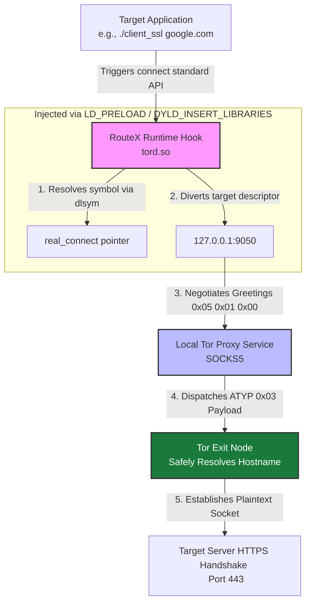

# 🛡️ RouteX — Architectural Deep Dive
### System Interception & Transparent Proxying

> This document provides a definitive technical breakdown of **RouteX**, mapping its low-level execution path, runtime memory overrides, and cryptographic wrapping layers based on the core codebase.

---

## 📐 1. Architectural Blueprint & Execution Flow

RouteX is a systems-level utility that intercepts network-bound application requests at the **POSIX socket layer** and dynamically reroutes them through a local Tor circuit daemon. It guarantees proxy forcing **without modifying** the target application's binary or runtime configuration.



---

## 🔬 2. Low-Level Component Breakdown

### ⚙️ A. Core Engine & Interception Subsystem (`tord.c`, `tord.h`)

The runtime interceptor builds a shared library object (`tord.so`) that explicitly overrides the standard C library (`libc`) socket-binding symbols.

**🎯 The Interception Wrapper:** `tord.c` exposes a customized signature mapping the POSIX specification:

```c
int connect(int sockfd, const struct sockaddr *addr, socklen_t addrlen);
```

**🔗 Dynamic Loading Integration (`dlfcn.h`):** To avoid infinite looping recursive lookups during runtime tracking, RouteX initializes a function pointer tracking the actual underlying kernel socket layer using:

```c
real_connect = dlsym(RTLD_NEXT, "connect");
```

**🔀 Traffic Redirection Matrix:** Once a connection initialization sequence is tripped, RouteX builds a custom `sockaddr_in` layout:

- 📌 Address family forced to `AF_INET`
- 🔁 Target address bound to loopback routing (`127.0.0.1`)
- 🔌 Target network byte-order port forced to `9050` *(Local Tor control hub port)*

---

### 🧩 B. Custom RFC 1928 SOCKS5 Pipeline Implementation

After diverting the destination file descriptor (`sockfd`) to the Tor service, `tord.c` triggers a raw manual connection sequence over the established socket channel:

**🤝 The Greeting Handshake:** Constructs and passes binary stream `\x05\x01\x00` to initialize versioning configurations *(SOCKS5, 1 Auth Option, No Authentication)*.

**📦 The Command Vector:** Upon validation response, a targeted connection request block is packed:

| Bytes | Value | Description |
|-------|-------|-------------|
| `0–2` | `\x05\x01\x00` | SOCKS v5 · TCP Stream · Reserved padding |
| `3` (ATYP) | `\x03` | Domain Name type |
| Payload | `ROUTEX_HOSTNAME` | Target hostname from env variable |

> 🔒 **Anti-DNS Leak Engine:** Passing `ATYP = \x03` ensures the host OS bypasses the native `glibc` resolver entirely. No DNS requests touch local interfaces or ISP resolvers — hostname translation is offloaded to the **anonymous Tor Exit Node**, completely breaking host identity fingerprinting profiles.

---

### 🧪 C. Evaluation Clients (`client.c`, `client_ssl.c`)

To audit and confirm absolute data separation properties, RouteX ships two standalone testing clients:

| Client | Transport | Purpose |
|--------|-----------|---------|
| `client.c` | 📤 Plaintext | Validates basic tunnel delivery |
| `client_ssl.c` | 🔐 TLS/SSL | Validates encrypted layering over Tor |

**🔐 Cryptographic Layering (`client_ssl.c`):** Incorporates the OpenSSL Engine (`openssl/ssl.h`). Once the Tor/SOCKS handshake completes, the socket descriptor is bound to the SSL context:

```c
SSL_set_fd(ssl, sockfd);
```

> This creates an **isolated TLS session** wrapped securely inside an already encrypted, multi-hop anonymous route pipeline.

---

### 🏗️ D. Build System & Automation Matrix (`Makefile`, `.gitignore`)

**🔧 Makefile Compilation Targets:** Automates multi-architecture builds via `gcc` with explicit linker parameters:

| Flag | Purpose |
|------|---------|
| `-shared -fPIC` | Generates Position Independent Code for runtime library injection |
| `-ldl` | Links dynamic library resolution subsystem |
| `-lssl -lcrypto` | Links OpenSSL engine natively |

**🚫 `.gitignore` Boundary Control:** Ensures build artifacts (`*.so`, compiled binaries like `client`, `client_ssl`) do not pollute the production repository footprint.

---

<div align="center">

*RouteX — Transparent. Anonymous. Undetectable.*

</div>
